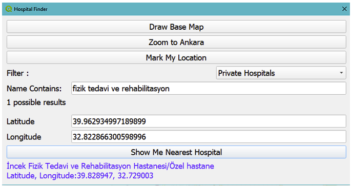
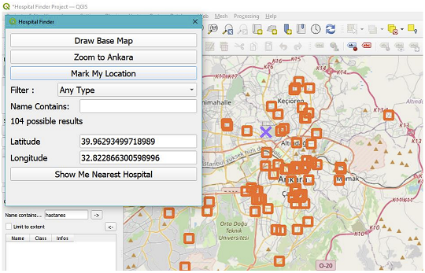

# QGIS-HospitalFinder
Hospital Finder plugin for QGIS. 
Currently available for only Ankara
## Filter hospitals
Filter hospitals by your requirements

## Helpful Markers
Your location and suitable hospitals are marked on map

## How to use?
1. Copy the plugin folder to %APPDATA%\QGIS\QGIS3\profiles\default\python\plugins\
2. Open QGIS, click manage and install plugins, enable hospital_finder
3. Click plugin's icon on the toolbar and run plugin
4. Click draw base map
5. Click zoom to ankara
6. Click mark my location and click somewhere on canvas
7. Enter your filters. (E.g.: Private hospitals, name contains: "fizik tedavi")
8. Click show me nearest hospital 
